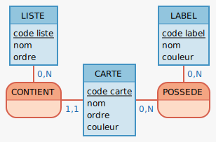

# GDP (Gestion de projet)

## 1. Recueil des besoins
Une base de données pour gérer un kanban. On doit pouvoir :
- Créer, modifier et supprimer des listes.
- Une liste possède un titre.
- Les listes peuvent contenir des cartes à l'interieur.
- Créer, modifier et supprimer des cartes.
- Une carte possède un titre, et une couleur (optionel).
- Les cartes peuvent avoir des tags.
- Créer, modifier et supprimer des tags.
- Un tag possède un titre, et une couleur (optionel).


## 2. User stories (liste des fonctionnalités)

|En tant que|Je veux pouvoir| Dans le but de|
|---|---|---|
|Utilisateur| afficher les listes | les voir|
|Utilisateur| Créer une liste| rajouter une liste au kanban|
|Utilisateur| Modifier une liste | changer son nom, sa position, etc...|
|Utilisateur| Supprimer une liste| supprimer une liste et ses cartes|
|Utilisateur| Créer une carte | rajouter une carte dans une liste|
|Utilisateur| Modifier une carte | changer son titre, sa couleur, sa liste..|
|Utilisateur| Supprimer une carte | l'effacer d'une liste|
|Utilisateur| Créer un label | pour l'associer à des cartes|
|Utilisateur| Modifier un label | changer sa couleur, son noom...|
|Utilisateur| Supprimer in label | l'enlever de toutes les cartes|
|Utilisateur| Associer une carte et un label| |
|Utilisateur| Dissocier une carte et un label| |


## 3. Merise (MCD + MLD)

### MCD




## MLD

### **List**

| Champ | Type | Peut être null | Valeur par défaut |
|---|---|---|---|
| id | SERIAL | non | aucun|
| name | TEXT | non | "" |
| order | INTEGER | non | 0 |
| createdAt | DATE | oui | null |
| updatedAt | DATE | oui | null |


### **Card**

| Champ | Type | Peut être null | Valeur par défaut |
|---|---|---|---|
| id | SERIAL | non | aucun|
| name | TEXT | non | "" |
| color | TEXT | non | "#FFF" |
| list_id | INTEGER | non | 0 |
| order | INTEGER | non | 0 |
| createdAt | DATE | oui | null |
| updatedAt | DATE | oui | null |

### **Tag**

| Champ | Type | Peut être null | Valeur par défaut |
|---|---|---|---|
| id | SERIAL | non | aucun|
| title | TEXT | non | "" |
| color | TEXT | non | "#FFF" |
| createdAt | DATE | oui | null |
| updatedAt | DATE | oui | null |

### **Card_has_Tag**

| Champ | Type | Peut être null | Valeur par défaut |
|---|---|---|---|
| card_id | INTEGER | non | aucun |
| tag_id | INTEGER | non | aucun |


## SQL
``` SQL
/* début de la transaction*/
BEGIN;

/* suppression des tables existantes */
DROP TABLE IF EXISTS "list", "card", "tag", "card_has_tag";

/* table list */
CREATE TABLE "list" (
    "id" SERIAL PRIMARY KEY,
    "name" TEXT NOT NULL DEFAULT '',
    "order" INTEGER NOT NULL DEFAULT 0,
    "created_at" TIMESTAMPTZ NOT NULL DEFAULT NOW(),
    "updated_at" TIMESTAMPTZ
);

/* table card */
CREATE TABLE "card" (
    "id" SERIAL PRIMARY KEY,
    "name" TEXT NOT NULL DEFAULT '',
    "order" INTEGER NOT NULL DEFAULT 0,
    "color" TEXT,
    "list_id" INTEGER NOT NULL REFERENCES list("id") ON DELETE CASCADE,
    "created_at" TIMESTAMPTZ NOT NULL DEFAULT NOW(),
    "updated_at" TIMESTAMPTZ
);

/* table tag */
CREATE TABLE "tag"(
    "id" SERIAL PRIMARY KEY,
    "name" TEXT NOT NULL DEFAULT '',
    "color" TEXT,
    "created_at" TIMESTAMPTZ NOT NULL DEFAULT NOW(),
    "updated_at" TIMESTAMPTZ
);

/* table card_has_tag */
CREATE TABLE "card_has_tag" (
    -- ON DELETE CASCADE supprimera l'association si la carte ou le tag sont supprimés
    "card_id" INTEGER NOT NULL REFERENCES card("id") ON DELETE CASCADE,
    "tag_id" INTEGER NOT NULL REFERENCES tag("id") ON DELETE CASCADE,
    "created_at" TIMESTAMPTZ NOT NULL DEFAULT NOW()
    -- pas d'updated_at, une relation ne se met pas à jour
);

/* seeding */
INSERT INTO "list" ("name")
VALUES ('Ma première liste');

INSERT INTO "card" ("name", "list_id")
VALUES ('Carte 1', 1),
       ('Carte 2', 1);

INSERT INTO "tag" ("name", "color")
VALUES ('Urgent', '#F00');

INSERT INTO "card_has_tag" ("card_id","tag_id")
VALUES (1,1);


/* fin de la transaction */
COMMIT;
```